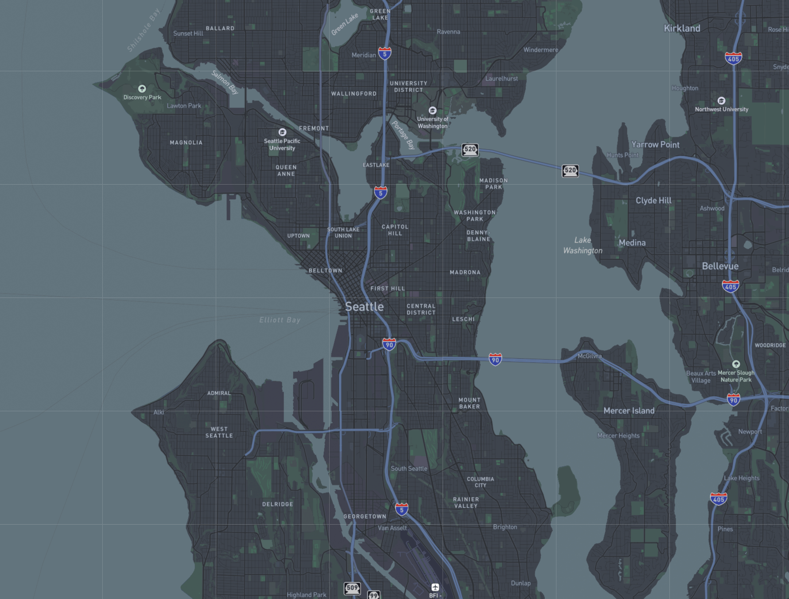
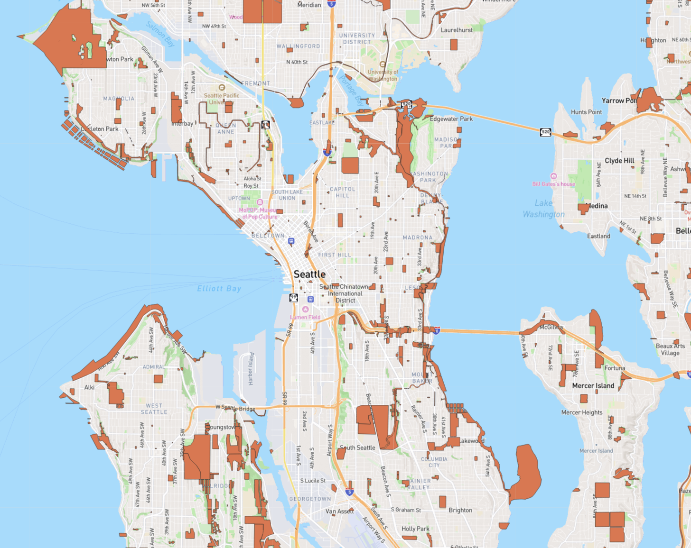
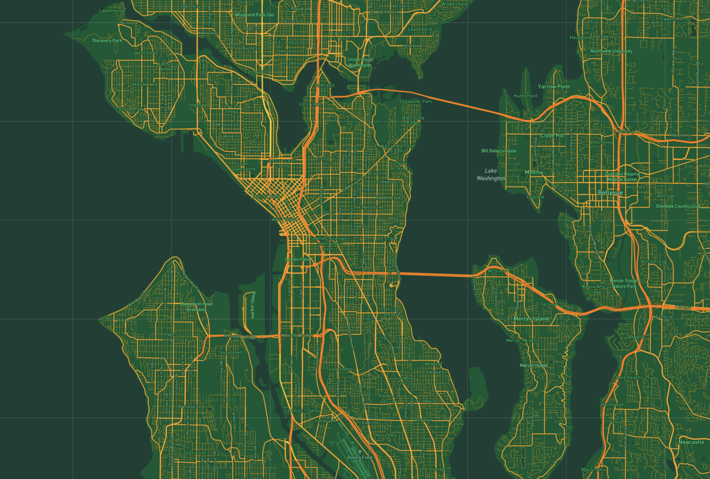

# GEOG458_Lab4

## Tile 1 Screenshot - Modified Basemap

- Description of Tile: Simplified basemap that only included roads and place names. 
- Geographic Area of Focus: Seattle, WA 
- Zoom Levels: Max Zoom 14; Min Zoom 10

## Tile 2 Screenshot - Map Data 

- Description of Tile: Data layer showing the location of parks in King County
- Geographic Area of Focus: Seattle, WA
- Zoom Levels: Max Zoom 14; Min Zoom 10

## Tile 3 Screenshot - Basemap and Data 

- Description of Tile: Combination of basemap and data
- Geographic Area of Focus: Seattle, WA and surrounding municipalities 
- Zoom Levels: Max Zoom 14; Min Zoom 10

## Tile 4 Screenshot - Seattle Supersonics Theme

- Description of Tile: Map tile made using the color scheme from the former Seattle Supersonics NBA team. 
- Geographic Area of Focus: Seattle, WA and surrounding municipalities 
- Zoom Levels: Max Zoom 14; Min Zoom 10
